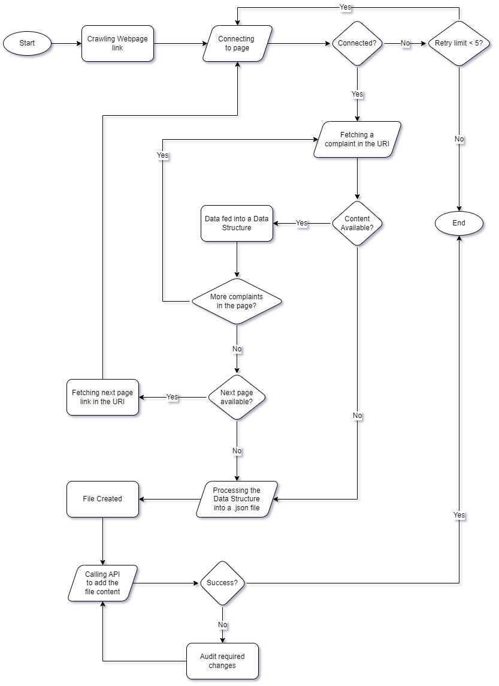

# IT Design

&nbsp;

## Legend

|Acronym|Full Form|Remarks|
|---|---|---|
|URL|Uniform Resource Locator|Link to a webpage|
|URI|Uniform Resource Identifier|Indication to a webpage content|
|S360|[Simplify360](https://simplify360.com/)|[Tata Play][Tataplay]'s backend manager|
|API|Application Programming Interface|Interface of handling backend data|

**Keywords**: _Tata Play, URL, URI, S360, Java, Json, API_

---

## Requirements

Websites (other than social media) that have forums listed in one URL rather than separate links, require crawling through to retrieve the information and complaints (if any).

S360 cannot crawl through these forum contents as they are URIs and not URLs.  
_**Note**: URIs, unlike URLs, specify the content rather than providing it._

The solution to this problem statement is creating custom crawlers that can fetch data from corresponding URIs.

### Constraints

- **[Tata Play][Tataplay]** uses java based framework for deployment and operations. Therefore, the source codes are preferred in `.java` format.
- S360's backend runs on API calls. Therefore, output has to be a `.json` file.
- Will have to work on frameworks for deployment as libraries need to be available as global dependencies.

## Concept of custom crawlers

Custom crawlers are programs that can fetch and scrape data from source codes, documents, etc.

In our use case we are using crawlers to fetch URI indicated data from given websites and parse that in a `.json` format for the backend insertion.

## Approach

- Source code deployment on a framework for global dependencies.
- Fetching HTML content from the webpage.
- Converting or parsing fetched data to `.json` file.
- Calling API to upload data to backend.

## Workflow

- Following diagram shares the code flow:  

    

- Codes should create `.json` file in the following format:  

    |Parameter|Description|Type|
    |---|---|:---:|
    |name|Customer Name (or ID)|Str|
    |message|Review Description Text|Str|
    |title|Review Title|Str|
    |postId|Review ID|Str|
    |postLink|Review Link|Str|
    |createdOnGMTDate|Date of Creation|Date (ISO8601)|
    |updatedOnGMTDate|Date of update|Date (ISO8601)|
    |sourceId|`rv` (constant value)|Str|
    |s_sourceName|`variable value`|Str|

- Fields will be uploaded to Social CRM using S360 API syntax.

[Tataplay]: https://www.tataplay.com/
