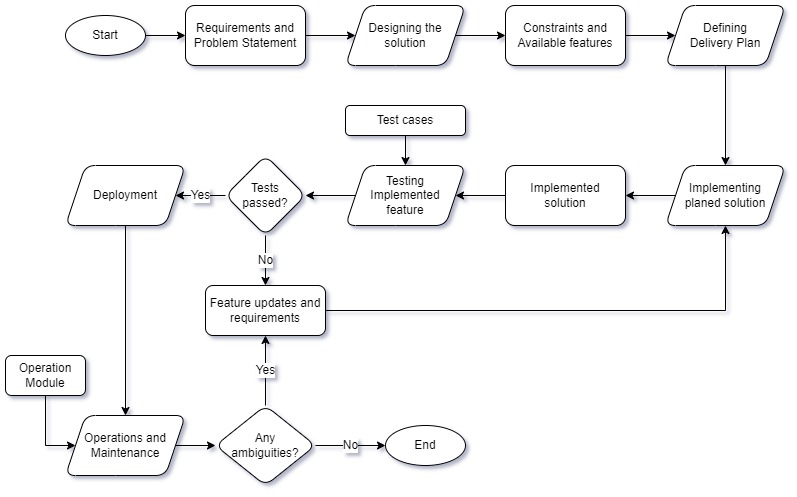

# IT Process for Tata Play

This document describes the flow of IT Process in Tata Play.

- The flow is segmented at various levels (aka, departments).
- Each level requires an authorisation from the manager of the corresponding department.
- After the authorisation it is forwarded to the next level until operations and maintenance.
- We follow an agile flow as implementation keeps getting updates as per changes applied from business and operations team.

---

The departments flow in the following order:

## 1. Requirements

- This is the step where the problem statement is discussed.
- Every possible outcome and iterations are put into consideration to refine the problem statement.
- This refined problem is aligned to the company workflow and forwarded for implementation.

## 2. Design

- Design handles the plan of execution to maintenance.
- The problem statement is review and a solution is thought out.
- The plan to lay this solution into the operations of the company is designed for the further departments to have an guide during any ambiguity.

## 3. Delivery

- This is the technical aspect of the design.
- With all the constraints and available facilities taken into consideration, an executable solution is put against the problem statement.
- This states the most optimised method of implementation and deployment.

## 4. Implementation

- With the delivery plan, the solution is actually implemented.
- Any ambiguity in this process triggers a change request in the preceding documents.
- The practicality is put to test and any corresponding change from the business side is dealt as backlog updates.

## 5. Testing

- This step verifies the credibility of the implemented feature.
- Any failure or update from the business process is called out to implementation.
- The updated changes are verified again until all considered test cases (that can be thought of) are passed by the implemented feature.

_**Note**: This phase is the reason for our IT process to be an agile flow_

## 6. Deployment

- The implemented solution requires hosting so that it is available as a company resource.
- The implementation is deployed on a platform as per operation requirements.

## 7. Operations &amp; Maintenance

- The deployed solution is transferred onto the hands of operations team
- The operations follow a set of instructions to execute the feature solution implemented.
- Operations are followed by maintenance as feedback for the implementation team and uninterrupted executions.
